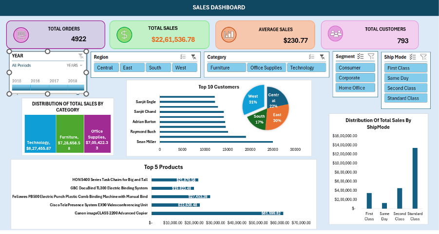
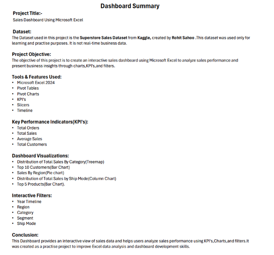

# 📊 Superstore Sales Dashboard - Microsoft Excel

## 📌 Project Overview
This project is an interactive Sales Dashboard built in Microsoft Excel using the Superstore Sales Dataset. The dashboard helps analyze sales performance through KPIs, charts, and interactive filters.

---

## 🛠️ Tools Used
- Microsoft Excel 2024
- Pivot Tables
- Pivot Charts
- Slicers
- Timeline
- Conditional Formatting

---

## 📂 Dataset
- Superstore Sales Dataset (Kaggle)
- Used for learning and practice purposes only.

---

## 📈 Dashboard Features
- Total Sales KPI
- Total Orders KPI
- Average Sales KPI
- Total Customers KPI
- Sales by Category (Treemap)
- Sales by Region (Doughnut Chart)
- Sales by Ship Mode (Column Chart)
- Top 10 Customers
- Top 5 Products
- Interactive Slicers
- Timeline Filter

---

## 📷 Dashboard Preview

---

## 📄 Dashboard Summary

---

## 🎯 Key Insights
- Interactive dashboard for sales analysis.
- Easy filtering using slicers and timeline.
- Visual representation of business performance.
- Helps identify top customers, products, and sales trends.

---

## 📁 Files Included
- Dashboard_final.xlsx
- Superstore_Sales_Dashboard.pdf
- Superstore_Sales_Dashboard.png
- Superstore_Dashboard_Summary.png

---

## 🚀 Author
**Saniya Begum**

Aspiring Data Analyst | Excel | SQL | Power BI (Learning) | Python (Learning)
